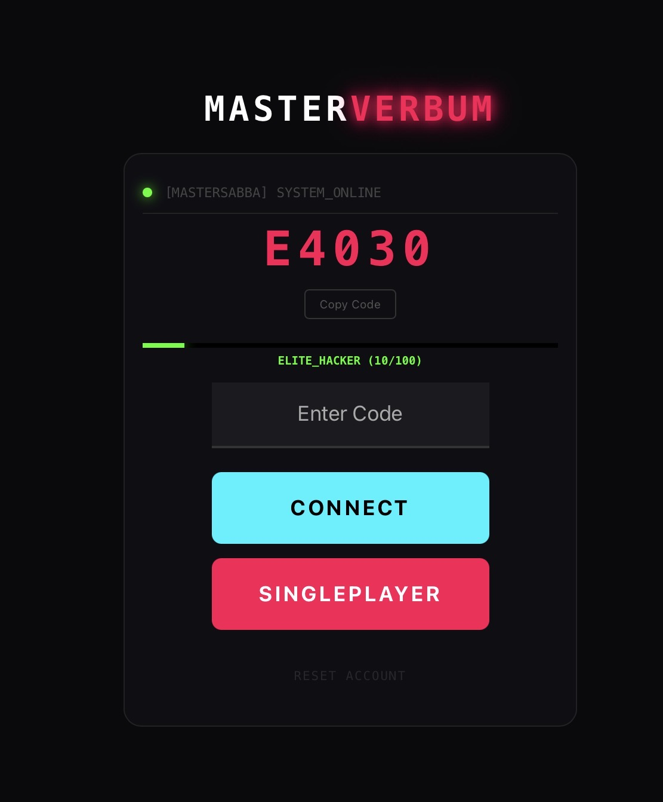

# MasterVerbum
MasterVerbum Elite è un gioco multiplayer online di tipo “hangman cyberpunk” con sistema Peer-to-Peer (via PeerJS), rank progressivo e abilità speciali.
Il giocatore deve indovinare parole segrete contro un avversario o contro il bot, in una partita a tempo limitato. Ogni vittoria aumenta il punteggio, sblocca rank e abilita nuove regole di difficoltà dinamica.

Il gioco integra:

- Sistema PvP real-time (PeerJS)
- Modalità singleplayer con generazione parole API
- Rank system con progressione (HACKER → GOD_MODE)
- Poteri attivabili (LOCK, REVEAL, SHIELD / BLACKOUT, GLITCH, FOG)
- Effetti visivi “hacker UI”
- LED di stato interattivo che apre il manuale segreto dei poteri

💡 Il LED verde
Il piccolo LED in alto a sinistra è uno stato di sistema:
🔴 OFF → sistema offline
🟢 ON → connessione attiva
click sul LED → apre il manuale dei power-up (overlay nascosto con spiegazione dei poteri)

È collegato alla repository centrale MasterHub (https://mastersabba.github.io/MasterSabba/), che contiene tutti i minigiochi della serie Master.

